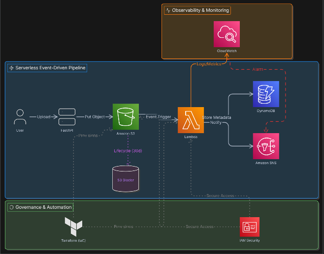

# 🚀 ServerlessSync

ServerlessSync is a cloud-native, event-driven file processing pipeline built on AWS using serverless architecture principles. The system automatically processes uploaded files, stores metadata, sends notifications, monitors failures, and optimizes storage costs — all without managing traditional servers.

---

# 📌 Project Overview

This project demonstrates real-world cloud engineering concepts including:

- Serverless architecture
- Event-driven workflows
- Infrastructure as Code (Terraform)
- AWS IAM security
- Monitoring and alerting
- Cost optimization
- Automated cloud operations

The system is designed to simulate how modern companies process uploaded documents such as:
- resumes
- invoices
- contracts
- KYC documents
- internal company files

---

# 🏗️ Architecture

## Event Flow

User → FastAPI → Amazon S3 → AWS Lambda → DynamoDB → SNS → CloudWatch

### Long-Term Storage Optimization

Amazon S3 → Lifecycle Rule → S3 Glacier (after 30 days)

---

# 🖼️ Architecture Diagram

> Add your generated architecture diagram image here

```md

```

---

# ⚙️ AWS Services Used

| Service | Purpose |
|---|---|
| Amazon S3 | Secure cloud file storage |
| AWS Lambda | Event-driven file processing |
| Amazon DynamoDB | Metadata storage |
| Amazon SNS | Email notifications |
| Amazon CloudWatch | Monitoring and logging |
| CloudWatch Alarms | Failure alerting |
| AWS IAM | Least-privilege security |
| Terraform | Infrastructure as Code |
| Amazon S3 Glacier | Long-term archival storage |

---

# 🔄 How the System Works

## 1. File Upload
Users upload files using a FastAPI backend API.

## 2. S3 Storage
Uploaded files are stored inside Amazon S3.

## 3. Event Trigger
S3 object creation events automatically trigger an AWS Lambda function.

## 4. Metadata Processing
Lambda extracts:
- file ID
- filename
- upload timestamp
- bucket information

## 5. DynamoDB Storage
Processed metadata is stored inside the `file-metadata` DynamoDB table.

## 6. Notification System
SNS sends email notifications after successful processing.

## 7. Monitoring
CloudWatch collects:
- logs
- invocation metrics
- error metrics
- execution visibility

## 8. Alerting
CloudWatch Alarms trigger SNS alerts when Lambda failures occur.

## 9. Cost Optimization
S3 Lifecycle Rules automatically move older files to Glacier after 30 days.

---

# 🔐 Security Architecture

The project follows AWS security best practices:

- IAM least-privilege access
- Service-specific IAM roles
- Secure AWS-managed infrastructure
- Controlled inter-service permissions
- CloudWatch logging for observability

Example:
- Lambda only has permissions required for:
  - DynamoDB PutItem
  - SNS Publish
  - CloudWatch Logs

---

# 📊 Monitoring & Observability

CloudWatch is used for:

- Lambda execution logs
- Error tracking
- Invocation metrics
- Operational monitoring
- Alarm-based alerting

### Configured Alarm
- Lambda Errors > 0
- Sends automatic SNS email alerts

---

# 💰 Cost Optimization

The architecture uses serverless and managed AWS services to reduce operational costs.

### Optimizations Implemented
- Pay-per-use Lambda execution
- DynamoDB on-demand billing
- S3 lifecycle transition to Glacier after 30 days
- No always-running servers

---

# 🧪 Failure Handling

The system includes failure testing and monitoring.

### Tested Scenarios
- Invalid file uploads
- Lambda processing failures
- CloudWatch alarm triggering
- SNS failure notifications

This demonstrates operational resilience and production-style monitoring.

---

# 🏗️ Infrastructure as Code (Terraform)

Terraform is used to automate cloud resource provisioning.

## Managed Resources
- S3 bucket
- DynamoDB table
- SNS topic
- IAM policies
- Monitoring resources

### Terraform Commands

```bash
terraform init
terraform plan
terraform apply
```

---

# 📁 Project Structure

```bash
serverlesssync/
│
├── backend/
│   ├── main.py
│   └── requirements.txt
│
├── terraform/
│   ├── main.tf
│   ├── provider.tf
│   └── terraform.tfstate
│
├── architecture/
│   └── serverlesssync-architecture.png
│
├── docs/
│
└── README.md
```

---

# 🚀 Deployment Steps

## 1. Clone Repository

```bash
git clone <your-repository-url>
cd serverlesssync
```

## 2. Install Dependencies

```bash
pip install -r requirements.txt
```

## 3. Configure AWS Credentials

```bash
aws configure
```

## 4. Deploy Infrastructure

```bash
cd terraform
terraform init
terraform apply
```

## 5. Start FastAPI Server

```bash
uvicorn main:app --reload
```

---

# 🎯 Key Cloud Engineering Concepts Demonstrated

- Serverless Architecture
- Event-Driven Systems
- Infrastructure as Code
- IAM Security
- Monitoring & Alerting
- Failure Handling
- Cloud Cost Optimization
- Cloud Automation
- Managed AWS Services
- Asynchronous Processing

---

# 📈 Scalability

The system is designed to scale automatically using AWS managed services.

- S3 scales for massive file storage
- Lambda scales automatically with uploads
- DynamoDB on-demand scaling
- SNS supports asynchronous notification delivery
- No infrastructure scaling required manually

---

# 🔮 Future Enhancements

Possible future improvements:

- AWS Step Functions workflow orchestration
- SQS Dead Letter Queue (DLQ)
- AWS Textract document analysis
- Amazon Rekognition image processing
- API Gateway integration
- AWS Cognito authentication
- CI/CD pipelines using GitHub Actions

---

# 💼 Resume Description

Designed and implemented a serverless event-driven file processing pipeline using AWS S3, Lambda, DynamoDB, SNS, CloudWatch, IAM, and Terraform. Built automated monitoring, alerting, lifecycle-based storage optimization, and Infrastructure as Code workflows demonstrating cloud-native architecture, operational resilience, and scalable backend engineering principles.

---

# 👩‍💻 Author

Mayuri More
